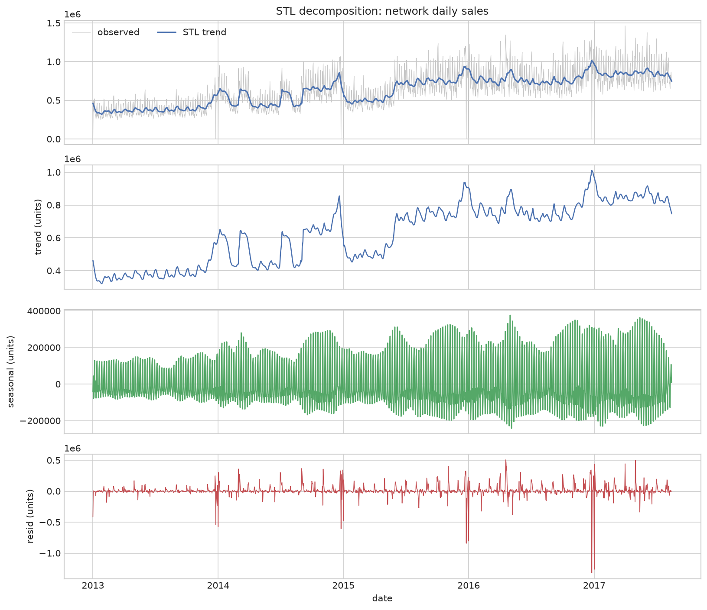
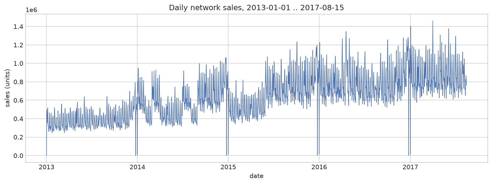
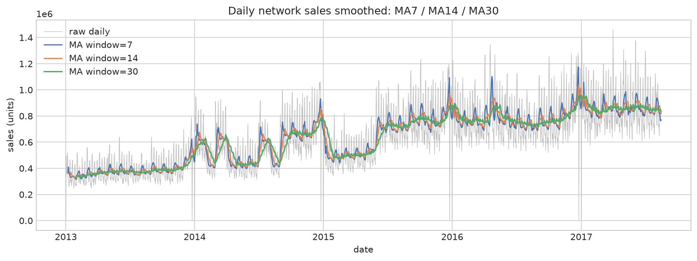
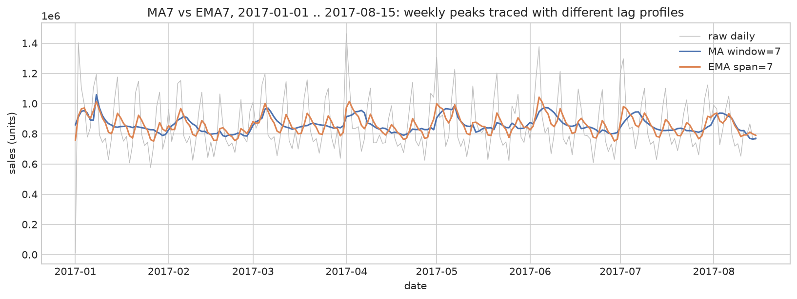
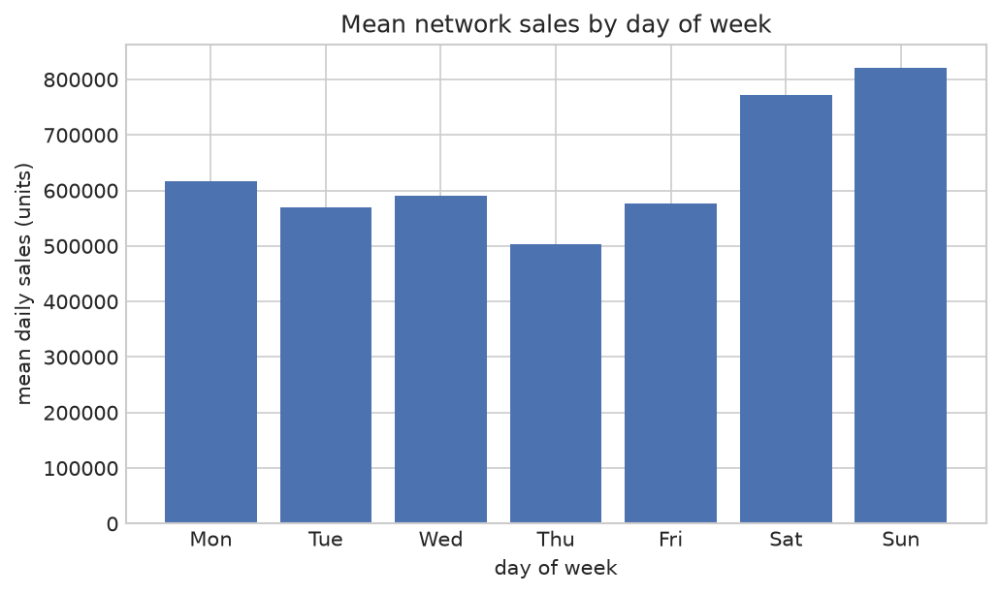
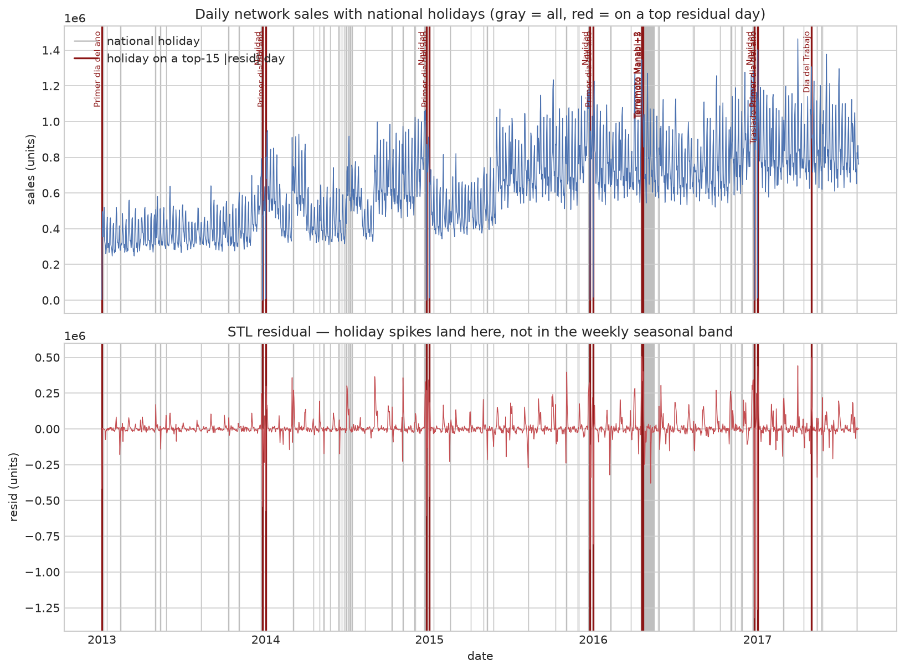
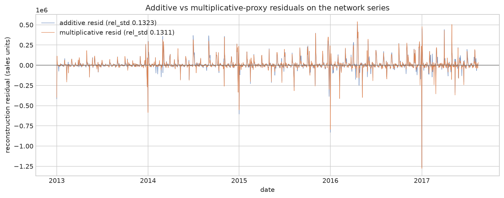

# Store Sales — описательный анализ временных рядов

Полный воспроизводимый описательный цикл на данных Kaggle-соревнования
Corporación Favorita: проверка целостности данных, сглаживание тренда и
сезонности (MA/EMA), STL-декомпозиция, сопоставление пиков с национальными
праздниками и честный вердикт в формате ежемесячного отчёта. Проект
намеренно **описательный**: без прогноза, без тестов значимости, без
разбивки по магазинам/регионам.

[English version](README.md)




> **TL;DR — ответ для ежемесячного отчёта.** Дневные продажи сети сильно
> выросли с 2013 до конца 2016 (сила тренда STL F_t = 0.793; средние тренда
> по годам 385 121 → 846 530) и затем ослабли к 2017. Продажи держат
> стабильный недельный ритм с пиком в воскресенье (в среднем 821 794/день
> против впадины в четверг — 503 173/день), а календарные выбросы — это
> национальные праздники: 14 из 15 самых больших дней остатка приходятся
> ровно на праздник, в первую очередь рождественские закрытия сети (Navidad
> 2016 — −1 321 021) и новогодние всплески (+1 262 485, 2017-01-01). Между
> аддитивной и мультипликативной моделями данные выбирают
> мультипликативную, но с отрывом всего 0.94% относительного разброса
> остатков — практически ничья. Вердикт описательный и разведочный: он
> **не** прогнозирует, не строит ARIMA-модель и не заявляет статистической
> значимости ни для одной цифры. Полное обоснование:
> `reports/04_executive_summary.html`.

## Содержание

- [Введение](#введение)
- [Технологический стек](#технологический-стек)
- [Структура проекта](#структура-проекта)
- [Быстрый старт](#быстрый-старт)
- [Подробная установка и запуск](#подробная-установка-и-запуск)
- [Данные](#данные)
- [Разведочный анализ (EDA)](#разведочный-анализ-eda)
- [Методология](#методология)
- [Результаты](#результаты)
- [Обучающие материалы](#обучающие-материалы)
- [Тестирование](#тестирование)
- [Ограничения](#ограничения)
- [Рекомендации / следующие шаги](#рекомендации--следующие-шаги)
- [Поддержка](#поддержка)
- [Вклад в проект](#вклад-в-проект)
- [Лицензия](#лицензия)
- [Благодарности](#благодарности)

## Введение

Проект симулирует регулярную задачу аналитика: ответить на вопросы, которые
ежемесячный отчёт задаёт о дневных продажах, — в описательных терминах.
Он построен в учебных/портфолио-целях: каждый этап — это протестированная
переиспользуемая функция из `src/`, а логика каждого решения
задокументирована в `notes/`.

Четыре вопроса ежемесячного отчёта и где на них отвечается:

| Вопрос ежемесячного отчёта | Где живёт ответ |
| -------------------------- | --------------- |
| Есть ли долгосрочный тренд и куда он ведёт? | `src/smoothing.py`, ноутбуки 02–03 |
| Когда сезонный пик и чем он объясняется? | `src/decomposition.py`, ноутбук 03 |
| Каков недельный ритм (какие дни пиковые)? | `src/eda.py`, ноутбук 04 §3 |
| Аддитивная или мультипликативная модель? | `src/decomposition.py`, ноутбук 04 §4 |

Основные достижения:

- Целостность данных проверена до любых выводов (единица анализа,
  дубликаты, пропущенные дни календаря, отрицательные продажи, диапазоны
  значений).
- Взгляды на тренд через простые (MA) и экспоненциальные (EMA) скользящие
  средние — протестированные формулы, сверка с `pandas`.
- STL-декомпозиция (тренд + недельная сезонная полоса + остаток) с метриками
  силы сезонности и тренда F_s и F_t (Wang, Smith & Hyndman).
- Сопоставление не-недельных пиков с национальными праздниками — 14 из 15
  топ-дней остатка приходятся ровно на праздник.
- Честное сравнение аддитивной и мультипликативной моделей, поданное как
  near-tie, которым оно и является (разрыв 0.94%, тест не проводился).

> [!NOTE]
> Чем этот проект **не** является: он не прогнозирует продажи, не проводит
> тестов статистической значимости и не углубляется в аналитику по
> магазинам/регионам. Это осознанные границы объёма, а не упущения — см.
> [Ограничения](#ограничения).

## Технологический стек

| Категория           | Технологии                                               |
| ------------------- | -------------------------------------------------------- |
| Язык                | Python 3.12.3                                            |
| Статистика          | statsmodels (STL), NumPy                                 |
| Обработка данных    | pandas 3.0.6                                             |
| Визуализация        | Matplotlib                                               |
| Ноутбуки            | Jupyter (воспроизводимая сборка из build_*.py)           |
| Тестирование        | pytest (56 тестов)                                       |
| Окружение           | uv / venv, `requirements.txt` с зафиксированными версиями |

## Структура проекта

```
├── src/                  Переиспользуемые тестируемые функции (eda, smoothing, decomposition)
├── tests/                pytest-покрытие для src/ (56 тестов)
├── notebooks/            Этапы 01–04, собираются из build_*.py (выводы встроены)
├── reports/              Автономный HTML-отчёт (nbconvert)
├── assets/               PNG-графики, переиспользуемые README и ноутбуками
├── notes/                Учебные заметки по этапам (русский, термины на английском)
├── data/                 Данные (источник в data/README.md, CSV не коммитится)
├── README.md             Английская версия этого файла
├── README_ru.md          Этот файл
├── LICENSE               MIT
└── requirements.txt      Зафиксированные зависимости Python
```

## Быстрый старт

Предварительное условие: **Python 3.12** и данные в каталоге `data/` (CSV
исключён из git — инструкции по загрузке в `data/README.md`). Далее
настройте окружение любым из вариантов.

**Вариант A: uv (рекомендуется)**

```bash
git clone https://github.com/<your-user>/store-sales-time-series.git
cd store-sales-time-series
uv venv .venv
uv pip install --python .venv/bin/python -r requirements.txt
.venv/bin/python -m pytest tests/ -q          # 56 passed
```

**Вариант B: классический venv + pip**

```bash
git clone https://github.com/<your-user>/store-sales-time-series.git
cd store-sales-time-series
python3 -m venv .venv
source .venv/bin/activate
pip install -r requirements.txt
python -m pytest tests/ -q                     # 56 passed
```

**Вариант C: посмотреть отчёт без установки**

Откройте `reports/04_executive_summary.html` в браузере — это автономный
HTML-файл со всеми рисунками внутри (Jupyter не требуется).

## Подробная установка и запуск

Предварительные условия и настройка окружения — как в
[Быстром старте](#быстрый-старт).

Пересборка всех ноутбуков из тестируемых функций `src/` (скрипты должны
выполняться из каталога `notebooks/`):

```bash
cd notebooks
for b in build_01_eda build_02_smoothing build_03_stl build_04_summary; do
  ../.venv/bin/python "$b.py"
done
cd ..
```

Экспорт итогового отчёта в автономный HTML:

```bash
.venv/bin/python -m jupyter nbconvert --to html \
  --output-dir reports notebooks/04_executive_summary.ipynb
```

Интерактивный запуск ноутбука:

```bash
.venv/bin/python -m jupyter notebook notebooks/04_executive_summary.ipynb
```

Пересборка ноутбуков детерминирована: повторный прогон цикла даёт
byte-identical `.ipynb` (стабильные cell id, без таймстампов исполнения),
поэтому `git status` остаётся чистым после любой пересборки.

## Данные

Источник: **Store Sales — Time Series Forecasting**, Kaggle-соревнование от
Corporación Favorita (крупного эквадорского бакалейного ритейлера).
Инструкции по повторной загрузке и полная схема — в `data/README.md`.

| Статистика                  | Значение         |
| --------------------------- | ---------------- |
| Строк                       | 3 000 888        |
| Магазинов                   | 54               |
| Семейств товаров            | 33               |
| Диапазон дат                | 2013-01-01 .. 2017-08-15 (1 688 дней) |
| Заполненные нулём закрытия  | 25 дек 2013–2016 (Рождество, задокументировано и аудируемо) |
| Самый крупный день          | 2017-04-01 → 1 463 084 (не праздник) |

Используемые файлы: `train.csv` (схема `id`, `date`, `store_nbr`, `family`,
`sales`, `onpromotion`), `stores.csv` (city, state, тип A–E, cluster) и
`holidays_events.csv` (национальные/региональные/локальные праздники с
переносами).

Файлы **не используемые** — осознанное проектное решение: `oil.csv`,
`transactions.csv`, `test (1).csv` и `sample_submission (1).csv`. Цена на
нефть и транзакции — вероятные внешние факторы, но объём проекта — описание
единого ряда дневных продаж сети; добавление регрессоров превратило бы
описательный анализ в задачу моделирования (см.
[Ограничения](#ограничения), [Рекомендации](#рекомендации--следующие-шаги)).

Очистка: ничего не удаляется. Целостность данных проверяется до анализа
(нет дубликатов `(date, store_nbr, family)`, нет пропусков, нет
отрицательных продаж, нет разрывов дневного календаря). Четыре дня
рождественских закрытий отсутствуют в исходных данных и заполняются
нулями конвейером (`daily_network_sales`, полный календарь —
задокументированная, аудируемая политика); они остаются нулями для
STL-этапов и заменяются средним соседей **только** для
сравнения аддитивной и мультипликативной моделей, причём заменённые строки
печатаются в ноутбуке 04, чтобы политика была аудируемой.

## Разведочный анализ (EDA)

- Дневные продажи сети шумны на дневном масштабе, поэтому недельный ритм не
  виден в сыром ряду — прежде любого вывода о тренде нужно сглаживание (см.
  [Методология](#методология)).
- Недельный профиль показывает чёткий стабильный ритм: пик — воскресенье,
  впадина — четверг.
- Только описательные числа — никаких выводов о значимости из EDA; все
  сводные цифры ниже пересчитывает ноутбук 04.



> [!NOTE]
> Этап EDA нужен, чтобы зафиксировать единицу анализа (дневной ряд сети,
> одна строка на дату) и проверить допущения (пропущенные дни, закрытия,
  распределение продаж) до любой декомпозиции. Это и есть золотой стандарт
  «данные прежде выводов».

## Методология

Все формулы ниже реализованы как тестируемые функции `src/`
(`src/smoothing.py`, `src/decomposition.py`).

**Простое скользящее среднее (MA).** Окно из `w` предшествующих дней; окна
7 / 14 / 30 исследуют тренд на дневном, недельном и ~месячном горизонте:

$$\text{MA}_w(y_t) = \frac{1}{w} \sum_{i=0}^{w-1} y_{t-i}$$



**Экспоненциальное скользящее среднее (EMA).** Тот же горизонт, что у MA
со span `s`, но недавние наблюдения весят больше — `alpha = 2 / (s+1)`:

$$\text{EMA}_t = \alpha\, y_t + (1-\alpha)\, \text{EMA}_{t-1}, \qquad \alpha = \frac{2}{s+1}$$

Две сглаженные кривые согласованно отвечают на вопрос о тренде (ноутбуки 02
и 04): уровень сильно растёт с 2013 до конца 2016 и ослабевает к 2017.
Разница MA и EMA существенна, потому что их *профили запаздывания* при
одинаковом порядке различны — MA жёстко обрывается за окном, EMA никогда
полностью не забывает, — что и вскрывают годовые пики:



**STL-декомпозиция.** `statsmodels` STL с `period=7` (недельный ритм,
измеренный на этапе 1) и устойчивыми (robust) внутренними/внешними циклами,
аддитивная по построению:

$$y_t = T_t + S_t + R_t$$

**Сила сезонности и тренда** (Wang, Smith & Hyndman, 2006): доля дисперсии,
которую объясняет компонент, относительно того, что оставляет тренд:

$$F_s = \max\!\left(0,\ 1 - \frac{\mathrm{Var}(R_t)}{\mathrm{Var}(R_t + S_t)}\right), \qquad
F_t = \max\!\left(0,\ 1 - \frac{\mathrm{Var}(R_t)}{\mathrm{Var}(R_t + T_t)}\right)$$

**Аддитивная против мультипликативной.** Мультипликативная сезонная модель
аппроксимируется как STL на `log(y)` с обратным эксп-пересчётом компонент,
и обе ветви сравниваются по `resid_relative_std = resid.std() / series.mean()`
(одна и та же безразмерная метрика остатков на обеих ветвях). Правило
решения (задокументировано в `src/decomposition.py`): выбирается меньший
`resid_relative_std`.

## Результаты

| Находка | Значение | Доказательство |
| ------- | -------- | -------------- |
| Сила тренда F_t | 0.793 | `seasonality_strength`/`trend_strength`, ноутбук 04 |
| Средние тренда по годам 2013 / 2017 | 385 121 / 846 530 | ноутбук 04 |
| Пик компонента тренда | 1 010 730 около 2016-12 (среднее декабря 931 604) | ноутбук 04 |
| Недельный ритм (сырые средние) | воскресенье 821 794 против четверга 503 173 (амплитуда ~318 621) | ноутбук 04 |
| Сезонная полоса (STL) | воскресенье +215 863 ед. выше середины недели; четверг −136 391 | ноутбук 04 |
| Сила сезонности F_s | 0.570 (сеть) | ноутбук 04 |
| Национальные праздники в топ-15 дней остатка | 14 из 15 | ноутбук 04 |
| Крупнейшие эффекты праздников | Navidad 2016 −1 321 021; Новый год +1 262 485 (2017-01-01) | ноутбук 04 |
| Магазин 44 (тип A, крупный) | F_s 0.633, F_t 0.711 | ноутбук 03 |
| Магазин 26 (тип D/E, малый) | F_s 0.171, F_t 0.306 (слабая недельная сезонность) | ноутбук 03 |
| Выбор модели | мультипликативная, но с отрывом 0.94% (RRS 0.1311 против 0.1323) — near-tie | ноутбук 04 §4 |



Единственный день, который ряд не может объяснить праздником, —
**2017-04-01** (1 463 084, крупнейший день за весь диапазон). Ноутбук 04
честно сообщает его как факт без причинной истории, а не выдумывает её.





> [!IMPORTANT]
> Строка «выбор модели» — это **near-tie, а не вердикт**. Никакой тест на
> разрыве 0.94% не запускался; обе подгонки рассказывают одну и ту же
> историю для ежемесячного отчёта. «Выбрана мультипликативная» описывает
> задокументированное правило решения, а не заявление, что одна модель
> содержательно лучше.

**Вердикт.** Сеть сильно росла с 2013 до конца 2016 и ослабела к 2017;
продажи держат стабильный недельный ритм с пиком в воскресенье; календарные
выбросы — национальные праздники (14 из 15 крупнейших дней остатка), прежде
всего рождественские закрытия и новогодние всплески. Этот вердикт дословно
совпадает в ноутбуке 04 и `reports/04_executive_summary.html`; он
описательный и разведочный, не прогнозирует и не заявляет значимости.

## Обучающие материалы

Репозиторий — учебный, и каждое аналитическое решение объяснено с первых
принципов. Объяснения лежат в `notes/` (на русском, с английским ключевым
термином при каждом первом упоминании):

| Заметка | Этап | Почему это важно |
| ------- | ---- | ---------------- |
| `notes/01_data_integrity_eda.md` | Целостность и EDA | данные прежде выводов; единица анализа; закрытия |
| `notes/02_smoothing.md` | MA / EMA | зачем нужно сглаживание, окно vs span, профили запаздывания |
| `notes/03_stl_decomposition.md` | STL + праздники | тренд vs сезонность vs остаток; силы F_s / F_t; карта праздников |
| `notes/04_summary.md` | Итоговый отчёт | дисциплина «число-должно-иметь-код»; честный near-tie |
| `notes/05_readme_and_dod.md` | README и definition of done | дрейф README от реальности; согласованность вердиктов; воспроизводимый Quick Start |

Та же рамка «почему это важно» применяется в коде: каждая публичная функция
`src/` имеет docstring — цель, параметры, возвращаемое значение и
защищаемые краевые случаи.

## Тестирование

```bash
.venv/bin/python -m pytest tests/ -q
```

56 тестов (18 EDA + 18 сглаживание + 20 декомпозиция) покрывают
переиспользуемые функции, включая сверку с эталонными реализациями:

- `tests/test_eda.py` — контракт загрузки и типов, проверки целостности
  (дубликаты, пропуски, отрицательные продажи, разрывы календаря),
  агрегация по сети и по магазинам, выбор STL-магазинов, доля промо.
- `tests/test_smoothing.py` — ручные вычисления MA/EMA, эквивалентность
  эталонным объектам `pandas`, поведение прогрева, отклонение некорректных
  входов.
- `tests/test_decomposition.py` — реконструкция компонент STL и сверка со
  `statsmodels`, метрики силы на синтетических рядах, правило решения
  аддитив/мультипликатив, фильтр национальных праздников.

## Ограничения

- **Один ритейлер, один ряд.** Находки описывают сеть Corporación Favorita
  в 2013–2017 и не обобщаются на другие сети или годы.
- **Без прогноза.** STL — описательная декомпозиция прошлого. Пик тренда
  конца 2016 с последующим ослаблением к 2017 описывает данные; это не
  свидетельство, что будущие продажи продолжат снижаться. Для прогноза нужен
  отдельный, pre-registered этап моделирования.
- **Без статистической значимости.** Ни на одно число отчёта тест не
  запускался — вердикт описательный. В частности, разрыв 0.94%
  аддитив/мультипликатив докладывается как near-tie, а не как проверенная
  разница.
- **Без разбивки по магазинам/регионам.** Объём — описание на уровне сети.
  Аналитика магазинов появляется только как две контрольные декомпозиции
  (магазины 44 и 26), чья единственная задача — показать, что недельный
  ритм не артефакт агрегации.
- **Праздники не моделируются.** Национальные праздники объясняют самые
  крупные одноразовые всплески остатка, но недельная полоса STL не может
  учесть календарную дату — праздничные *эффекты* суть визуальные
  объяснения, а не оценённые эффекты.
- **Один необъяснённый день (2017-04-01)** — крупнейший день за весь
  диапазон и не совпадает ни с одним национальным праздником. Сообщается
  как факт без причинной истории.

## Рекомендации / следующие шаги

- **Операции:** планирование персонала и мощностей стоит опираться на
  стабильный воскресный пик (примерно в 1.6 раза выше четверговой впадины),
  а не на одноразовые праздничные всплески — те длятся один день.
- **Календарная осведомлённость:** рождественские закрытия (25 дек
  2013–2016) и новогодний всплеск — два крупнейших воспроизводимых эффекта;
  промо- и товарный календарь должны трактовать их как разные типы событий.
- **Разбивка по магазинам:** расширить ту же декомпозицию на группы
  магазинов, чтобы увидеть, какие типы (A против D/E) реально несут
  сетевой ритм — результат магазина 26 намекает, что малые магазины с
  ежедневным посещением могут его не иметь.
- **Этап прогнозирования:** отдельный, pre-registered ноутбук прогноза
  (семейство ARIMA или эквивалент), стартующий от трендово-сезонной
  структуры, найденной здесь, и оцениваемый настоящим бэктестингом, — он
  исключён из описательного объёма намеренно.
- **Внешние регрессоры:** вернуться к `oil.csv` и `transactions.csv` как к
  кандидатам в регрессоры, когда появится этап прогноза; они сознательно
  исключены из описательного объёма.

## Поддержка

- Нашли баг или есть вопрос: откройте GitHub issue.
- Обсуждение методологии: GitHub Discussions.

## Вклад в проект

Вклад приветствуется. Пожалуйста, сначала откройте issue, чтобы обсудить
предполагаемое изменение, держите функции `src/` покрытыми тестами и
пересобирайте ноутбуки скриптами `build_*.py` перед отправкой pull request.

## Лицензия

[MIT](LICENSE)

## Благодарности

- Данные: Store Sales — Time Series Forecasting, Kaggle-соревнование
  Corporación Favorita.
  https://www.kaggle.com/competitions/store-sales-time-series-forecasting
- STL-декомпозиция и эталонная сверка: `statsmodels`
  (Cleveland et al. 1990, декомпозиция сезонного тренда методом Loess).
- Метрики силы сезонности/тренда: Wang, Smith & Hyndman (2006),
  "Characteristic-based clustering for time series data".
- Сборка ноутбуков: `nbformat` / `nbclient`.
- Структура README следует конвенциям «Ultimate README Guide», принятым в
  этом портфолио: бейджи, соответствующие реальности, честные разделы
  ограничений и графики, отвечающие на тот вопрос, который иллюстрируют.